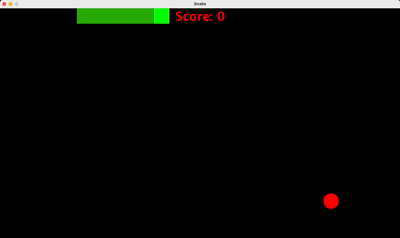

# 🐍 Snake Game in Java

A desktop Snake Game developed using **Java Swing** and **AWT** to demonstrate core **Object-Oriented Programming (OOP)** concepts, event-driven programming, graphics rendering, and real-time game logic. The project follows a modular class-based architecture with separate responsibilities for game initialization, window management, rendering, user input, collision detection, and game state management.

---

## 🎥 Demo



---

## 📷 Screenshots

### Gameplay


### Game Over


---

## ✨ Features

- Smooth snake movement
- Random apple generation
- Real-time score tracking
- Snake growth after eating apples
- Collision detection with walls and snake body
- Game Over screen
- Responsive keyboard controls
- Modular Object-Oriented Design

---

## 📚 Java Concepts Demonstrated

- Object-Oriented Programming (OOP)
- Classes and Objects
- Inheritance
- Encapsulation
- Event Handling
- Swing GUI Programming
- AWT Graphics
- Timer-based Animation
- Keyboard Listeners
- Arrays
- Random Number Generation

---

## 🛠 Technologies Used

- Java
- Java Swing
- Java AWT

---

## 📂 Project Structure

```text
Snake-Game-Java/
│
├── src/
│   ├── SnakeGame.java
│   ├── GameFrame.java
│   └── GamePanel.java
│
├── screenshots/
│   ├── gameplay.png
│   └── gameover.png
│
├── assets/
│   └── demo.gif
│
├── .gitignore
└── README.md
```

---

## 🏗 Project Architecture

```text
SnakeGame
    │
    ▼
GameFrame (JFrame)
    │
    ▼
GamePanel (JPanel)
    │
    ├── Rendering Graphics
    ├── Snake Movement
    ├── Apple Generation
    ├── Collision Detection
    ├── Score Management
    ├── Keyboard Input
    └── Game Loop
```

---

## 🎮 Controls

| Key | Action |
|------|--------|
| ↑ | Move Up |
| ↓ | Move Down |
| ← | Move Left |
| → | Move Right |

---

## 🚀 How to Run

Clone the repository

```bash
git clone https://github.com/pnhirapara/Snake-Game-Java.git
```

Navigate to the source folder

```bash
cd Snake-Game-Java/src
```

Compile the project

```bash
javac *.java
```

Run the application

```bash
java SnakeGame
```

---

## 💡 Learning Outcomes

Through this project, I gained practical experience with:

- Applying Object-Oriented Programming principles in Java
- Building desktop GUI applications using Swing
- Event-driven programming with ActionListener and KeyListener
- Implementing timer-based game loops
- Rendering graphics using Java AWT
- Managing application state and collision detection
- Organizing Java projects using a modular class structure

---

## 🚀 Future Improvements

- Pause / Resume functionality
- Restart button
- High score persistence
- Difficulty levels
- Sound effects
- Start menu
- Better graphics and animations

---

## 🙏 Acknowledgement

This project was created as part of my Java learning journey by following a Java Swing Snake Game tutorial. I used the tutorial to understand the implementation and strengthen my understanding of Java, Swing, event handling, graphics programming, and Object-Oriented Programming concepts.

---

## 👨‍💻 Author

**Preet Hirapara**

- GitHub: https://github.com/pnhirapara
