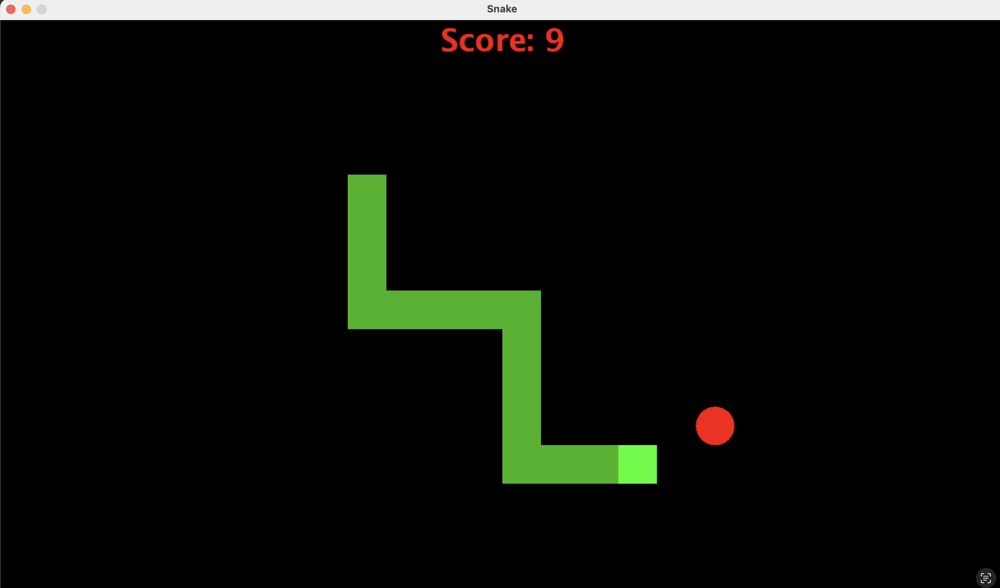
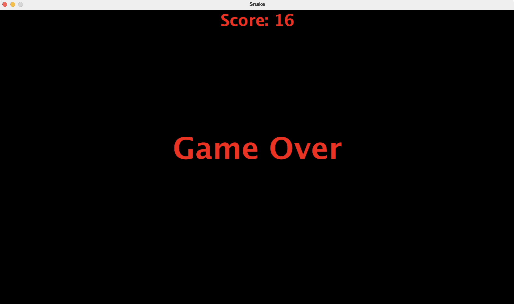

# 🐍 Snake Game in Java

A classic Snake Game built using **Java Swing** and **AWT**. The player controls the snake using the arrow keys to eat apples, grow in length, and achieve the highest possible score while avoiding collisions.

---

## 📷 Screenshots

### Gameplay



### Game Over



---

## 🎮 Features

- Smooth snake movement
- Keyboard controls
- Random apple generation
- Real-time score display
- Snake grows after eating apples
- Collision detection
- Game Over screen
- Object-Oriented Design using Java

---

## 🛠 Technologies Used

- Java
- Java Swing
- Java AWT
- Event Handling
- Object-Oriented Programming

---

## 📂 Project Structure

```
Snake-Game-Java/
│
├── src/
│   ├── SnakeGame.java
│   ├── GameFrame.java
│   └── GamePanel.java
│
├── screenshots/
│
├── assets/
│
└── README.md
```

---

## 🚀 How to Run

Clone the repository

```bash
git clone https://github.com/your-username/Snake-Game-Java.git
```

Go inside the project

```bash
cd Snake-Game-Java/src
```

Compile

```bash
javac *.java
```

Run

```bash
java SnakeGame
```

---

## 🎯 Controls

| Key | Action |
|-----|--------|
| ↑ | Move Up |
| ↓ | Move Down |
| ← | Move Left |
| → | Move Right |

---

## 🏗 Project Architecture

```
SnakeGame
    │
    ▼
GameFrame (JFrame)
    │
    ▼
GamePanel (JPanel)
    │
    ├── Paint Components
    ├── Snake Movement
    ├── Apple Generation
    ├── Collision Detection
    ├── Score Management
    └── Keyboard Controls
```

---

## 📌 Future Improvements

- Pause/Resume
- High Score Saving
- Difficulty Levels
- Sound Effects
- Background Music
- Start Menu
- Restart Button
- Better Snake Graphics

---

## 👨‍💻 Author

**Preet Hirapara**

GitHub: https://github.com/your-username
